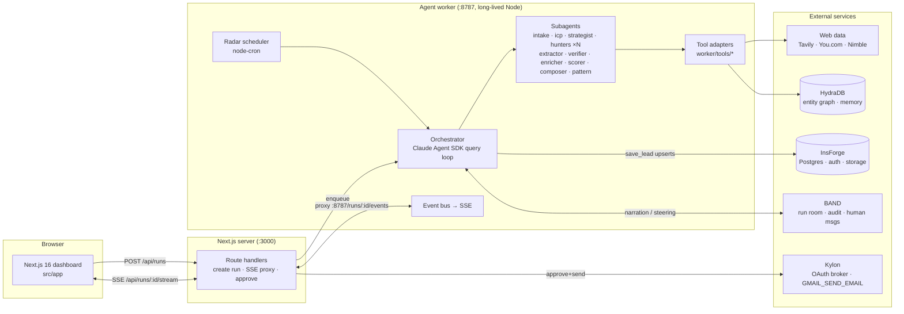

# CustomerZero — System Architecture

Companion to [`docs/PRD.md`](./PRD.md). This document is the build spec: a reader should be able to scaffold the system from it without further questions.

---

## 1. System overview

Two processes + five external services. The Next.js app never runs agents; the worker never renders UI.



**Why a separate worker:** the Claude Agent SDK spawns a long-lived `claude` subprocess with local-disk session state — explicitly unsuitable for serverless/edge routes. The worker is a plain Node process (`pnpm worker` locally; Railway/Fly for deploy, ~1 GiB RAM per concurrent run as a floor).

---

## 2. Run state machine

Run-level states (column `runs.state`, every transition emits an `event` row + SSE + BAND message):

```
INTAKE → ICP_CONFIRM → STRATEGY → HUNTING ⟲ → REVIEW → DELIVERED → RADAR
                                     │
   (any state) → FAILED | KILLED ←───┘   HUNTING loops until quota or budget floor
```

- **INTAKE** — fetch + analyze the domain; produce `ProductBrief`.
- **ICP_CONFIRM** — *human gate #1*: founder picks/edits an `ICPHypothesis`. Worker parks; resumes on API callback.
- **STRATEGY** — query packs (5 buckets × channels) + per-provider budget allocation.
- **HUNTING** — the loop. Signal-level pipeline below. Orchestrator checks after each wave: `verifiedLeads < quota && budget.remaining > floor` → continue; channel drought → re-strategize (visible pivot); else → REVIEW.
- **REVIEW** — *human gate #2*: founder approves drafts (per lead).
- **DELIVERED** — sends/exports done; report artifact stored in InsForge storage.
- **RADAR** — standing monitor active (§9).

Signal-level pipeline (column `signals.stage`):

```
FOUND → EXTRACTED → DEDUPED → VERIFIED → SCORED → ENRICHED → DRAFTED
                  ↘ DUPLICATE      ↘ REJECTED(reason)   ↘ BELOW_THRESHOLD (<50)
```

Invariant: a `leads` row is created **only** at `VERIFIED`, in the same transaction as its `evidence` row.

---

## 3. Agent roster

Runtime: `@anthropic-ai/claude-agent-sdk` (TS). One `query()` per run = the orchestrator; all helpers are **programmatic subagents** via `options.agents`, invoked through the `Agent` tool. Per-agent `model` does cost tiering; every agent's output is schema-validated (structured outputs / zod at the boundary).

| Agent | Model | Tools | Contract (out) | Job |
|---|---|---|---|---|
| `orchestrator` (main loop) | `claude-opus-4-8` | Agent, save_lead, band_post, budget_read | — | Owns the state machine, quota loop ("10 leads ≥ 65"), drought detection → re-strategy, budget governor, BAND narration. Optional upgrade: `claude-fable-5` if credits allow. |
| `intake-analyst` | `claude-sonnet-5` | nimble_extract, tavily_search | `ProductBrief` | Domain → product, outcome, buyer, price motion, geography, strongest use case. |
| `icp-architect` | `claude-opus-4-8` | (none — reasons over brief) | `ICPHypothesis[]` (2–3) | Personas + pain triggers + positive signals + disqualifiers + signal vocabulary in the audience's own words. |
| `hunt-strategist` | `claude-opus-4-8` | (none) | `QueryPlan` | ICP → query packs across the 5 buckets (explicit demand / pain / workaround / switching / timing) × channels; re-plan on drought with rationale. |
| `hunter` ×N (parallel, one per channel) | `claude-sonnet-5` | tavily_search, youcom_search, nimble_serp | `CandidateSignal[]` | Execute the pack; prefer original pages over snippets; return post/author/quote/URL/date candidates. `maxTurns: 12`. |
| `extractor` | `claude-haiku-4-5` | tavily_extract, nimble_extract | `ExtractedSignal` | Page → typed record. Cannot emit without `quote` + `url`; labels `date_unavailable`. |
| `verifier` (adversarial) | `claude-opus-4-8` | tavily_extract, nimble_extract (read-only) | `Verdict` | Independently re-fetch the source, quote-match (normalized similarity ≥ 0.8), recency + authorship check. **Prompted to refute; default REJECT.** Never sees the hunter's reasoning — only the claim. |
| `enricher` | `claude-sonnet-5` | nimble_extract, nimble_map_crawl, youcom_search | `Enrichment` | Company/role context + natural public channel + public contact points + person context, each with provenance; never guessed. |
| `scorer` | `claude-sonnet-5` | (none) | `ScoreBreakdown` | Rubric: pain 25 / fit 25 / timing 20 / reachability 15 / evidence 15 → 0–100 + stage. <50 → `BELOW_THRESHOLD`. |
| `composer` | `claude-sonnet-5` | (none) | `OutreachDraft` | ≤90-word opener: mention the public context → connect to the exact problem → product in one sentence → one low-friction question. Grounded ONLY in cited evidence. |
| `pattern-analyst` | `claude-haiku-4-5` | hydra_recall | `PatternInsight[]` + `RadarQueryPack` | Recurring pains across leads; distills the run's best-performing queries for the radar. |

Fan-out is batched (≤4 concurrent subagents) to respect API rate limits — an SDK-documented constraint.

---

## 4. Data contracts (`src/lib/schemas.ts`, shared by worker + app)

Zod schemas; the same shapes are used as Agent SDK structured-output JSON schemas and as API payloads.

```ts
ProductBrief     { domain, product, outcome, buyer, user, priceMotion, geography, topUseCase, inferences: string[] }
ICPHypothesis    { id, persona, industry, companySize, painTriggers: string[], positiveSignals: string[],
                   disqualifiers: string[], vocabulary: string[] }
QueryPlan        { icpId, packs: { bucket: 'demand'|'pain'|'workaround'|'switching'|'timing',
                   channel: 'reddit'|'hn'|'x'|'reviews'|'github'|'jobs'|'forums'|'news',
                   provider: 'tavily'|'youcom'|'nimble', queries: string[] }[], budget: BudgetAllocation }
CandidateSignal  { url, channel, title, authorHandle?, quoteCandidate, publishedAt?, foundBy }
ExtractedSignal  { url, channel, quote, authorHandle?, authorDisplay?, company?, publishedAt | 'date_unavailable',
                   sourceType, hash /* sha256(normalizedUrl + authorHandle) */ }
Verdict          { signalHash, verdict: 'VERIFIED'|'REJECTED', quoteMatchScore, recencyOk, authorshipOk,
                   rejectReason?, fetchedAt }
Enrichment       { company?, role?, companyContext?, channel: { kind: 'thread_reply'|'public_email'|'public_profile',
                   value, provenanceUrl }, reachabilityConfidence: 'high'|'medium'|'low',
                   contacts?: { kind: 'public_email'|'linkedin'|'x'|'github'|'reddit'|'website'|'other',
                   value, provenanceUrl }[], personContext?: string }
ScoreBreakdown   { pain: 0..5, fit: 0..5, timing: 0..5, reachability: 0..5, evidenceQuality: 0..5,
                   total: 0..100, stage: 'high_intent'|'problem_aware'|'trigger_present' }
Lead             { id, runId, name, type: 'person'|'company', signal: ExtractedSignal, score: ScoreBreakdown,
                   enrichment: Enrichment, whyFit, whyNow, caution? }
OutreachDraft    { leadId, channel, subject?, body /* ≤90 words */, groundedIn: url[] }
PatternInsight   { title, count, insight }
RadarQueryPack   { runId, icpId, queries: QueryPlan['packs'], intervalMinutes }
RunEvent         { runId, ts, seq, lane /* agent name or 'system' */, type: 'stage_change'|'agent_started'|'tool_call'|
                   'signal_found'|'signal_rejected'|'lead_verified'|'lead_scored'|'draft_ready'|'strategy_pivot'|
                   'budget_update'|'radar_alert'|'error', payload }
```

Validation failure at any boundary → one bounded retry with the validator error appended → dead-letter to `events` with `type:'error'` (run continues; that signal dies, the run doesn't).

---

## 5. Data model

### InsForge (system of record — Postgres + auth + storage)

Auth: InsForge JWT/OAuth for founders. All rows keyed by `user_id`.

| Table | Key columns | Notes |
|---|---|---|
| `runs` | id, user_id, domain, state, quota, depth, session_id, created_at | `session_id` = Agent SDK session for resume |
| `product_briefs` | run_id, brief jsonb | |
| `icp_hypotheses` | id, run_id, data jsonb, chosen bool | |
| `signals` | hash pk, run_id, stage, data jsonb, reject_reason | every candidate, including rejects — the audit trail |
| `leads` | id, run_id, signal_hash fk, data jsonb, score int, stage | created only on VERIFIED |
| `evidence` | id, lead_id fk **not null**, quote, url, published_at, fetched_at, quote_match_score | **DB-level invariant: leads without evidence are unrepresentable** (leads↔evidence enforced NOT NULL + FK, insert in one transaction) |
| `drafts` | id, lead_id, channel, body, status: draft/approved/sent, sent_at | |
| `events` | run_id, seq, event jsonb | replayable feed; SSE reconnect via `Last-Event-ID` → seq |
| `radar_queries` | run_id, pack jsonb, interval_min, active | |
| `radar_alerts` | id, run_id, lead_id, delivered_via text[] | |
| `budgets` | run_id, provider, allocated, spent | |

### HydraDB (memory — NOT the system of record)

Tenant model: `tenant_id = user_id`, `sub_tenant_id = run_id`.

- On every VERIFIED lead: `add_memory` (infer: true) with the entity summary (person/company, pain, quote, source) → HydraDB's entity resolution + temporal versioning build the market-pain graph.
- **Dedupe check** (pre-verify): `full_recall(tenant_id, query = entitySummary, graph_context: true, mode: 'fast')` → same person/company across different URLs/handles → mark `DUPLICATE` before spending verifier tokens. (Fast path first: exact `signals.hash` hit in Postgres.)
- **Radar delta**: recall decides "have we seen this entity/pain before?" — only genuinely new entities alert.
- **Explainability**: versioned memory answers "which stored fact influenced this score" — mirrors the receipts story at the memory layer.

---

## 6. Integration adapters (`worker/tools/`)

Every adapter: typed wrapper + **circuit breaker** (3 consecutive failures or any 429/402 → open 60s → half-open probe) + **spend meter** (writes `budgets`). Exposed to agents as in-process MCP tools via `createSdkMcpServer` (no subprocess). Hosted MCP servers (Tavily/Nimble/You.com/HydraDB all ship one) are the fallback if an adapter misbehaves mid-hackathon.

| Adapter | Surface | Auth | Limits/budget defaults |
|---|---|---|---|
| `tavily.ts` | `POST api.tavily.com/search` (basic=1 credit), `/extract` (1 credit per 5 URLs) | Bearer | Free 1,000 credits/mo; dev keys 100 RPM. Run budget: 300 credits. |
| `youcom.ts` | `POST ydc-index.io/v1/search` (livecrawl for full page), `/v1/contents`; `api.you.com/v1/research` (top-decile dossiers only, P1) | `X-API-Key` | $100 free credits; Search ~$5/1k. Run budget: 150 calls. |
| `nimble.ts` | Nimble Web/SERP + Extract (AI parsing schema, JS render) + Map/Crawl for contact pages; Node SDK `@nimble-way/nimble-js` or REST `sdk.nimbleway.com` | Bearer | 402 = credit exhausted → breaker opens. Run budget: 200 pages. **Caveat:** docs mid-migration — confirm exact SERP path against the OpenAPI spec / hackathon keys. |
| `hydradb.ts` | `@hydradb/sdk` (`HydraDBClient({token})`): `upload.add_memory`, `recall.full_recall` | API key (`HYDRA_DB_API_KEY`) | Free Ship tier: unlimited calls. |
| `band.ts` | REST Agent API (messages, chats, participants) + Human API; WebSocket for inbound; OpenAPI: `docs.band.ai/openapi.json`. (Official SDK is Python — we call REST/WS from TS.) | Band `agent_id` + `api_key` | One room per run. Post: stage handoffs, pivots, kills. Inbound founder messages → orchestrator `streamInput()` interrupt. |
| `kylon.ts` | `POST api.kylon.io/proxy/tools/execute` (`GMAIL_SEND_EMAIL`, `SLACK_SEND_MESSAGE`); Start Authorization flow for the founder's Gmail OAuth | `pak_` key in `x-api-key` | No SDK — raw HTTP. Waitlist-gated console: use sponsor-issued keys, test at event start. |
| `insforge.ts` | InsForge auto-generated Postgres REST + auth + storage | project keys | Confirm exact endpoint shapes against insforge.dev docs at build. |

**Search fallback chain** (capability-level, breaker-aware): `tavily → youcom → nimble_serp`.
**Extract fallback chain:** `tavily_extract → nimble_extract → youcom contents(livecrawl)`.

**Source policy (hard):** licensed search indexes + public pages only. No Reddit/X platform APIs (commercial gating), no login-walled fetches, no data brokers. Rejection is silent-proof: the verifier stores `fetched_at` + `quote_match_score` per evidence row.

---

## 7. Orchestration detail (Claude Agent SDK)

```ts
// worker/orchestrator.ts — one per run
const q = query({
  prompt: runPromptStream,               // AsyncIterable — allows mid-run steering injections
  options: {
    model: 'claude-opus-4-8',
    agents: { 'intake-analyst': …, 'icp-architect': …, 'hunt-strategist': …, hunter: …,
              extractor: …, verifier: …, enricher: …, scorer: …, composer: …, 'pattern-analyst': … },
    mcpServers: { customerzero: inProcessTools },   // createSdkMcpServer: save_lead, band_post, budget_read, hydra_*
    allowedTools: [...],                 // read-only per worker; no Write/Bash anywhere
    permissionMode: 'dontAsk',
    settingSources: [],                  // full isolation from user/project claude settings
    maxTurns: 250,
    persistSession: true,                // session_id captured from system:init → runs.session_id
  },
})
for await (const msg of q) routeToEventBus(msg)   // → events table + SSE + BAND mirror
```

- **Incremental checkpointing:** `save_lead` (in-process MCP tool, zod-validated) upserts lead+evidence to InsForge the moment the verifier passes it. A crashed run loses nothing; resume = `query({ options: { resume: runs.session_id } })`.
- **Human gates:** ICP_CONFIRM and REVIEW park the loop; the Next.js API writes the founder's choice and the worker injects it via the prompt stream (`streamInput`).
- **BAND steering:** WS listener → founder message ("drop agencies, focus fintech") → injected as an orchestrator turn; orchestrator acknowledges in the room and re-strategizes.
- **Event fan-out:** every `SDKMessage` becomes a `RunEvent`; subagent messages carry `parent_tool_use_id` → stable per-agent lanes in the UI.
- **Budget governor:** `budget_read` tool surfaces per-provider remaining; prompts instruct graceful degradation (quota 10 → 7 → 5 with a visible note) instead of dying mid-run.

---

## 8. Event & streaming architecture

1. Worker keeps an in-memory ring buffer per run **and** persists every event to `events` (seq-ordered).
2. Worker exposes `GET :8787/runs/:id/events` (SSE).
3. Next.js route handler `src/app/api/runs/[id]/stream/route.ts` proxies it (ReadableStream), auth-checked via InsForge JWT.
4. UI reconnects with `Last-Event-ID` → worker replays from `events` by seq. Refresh-proof.
5. Selected event types (`stage_change`, `strategy_pivot`, `lead_verified`, `signal_rejected`, `radar_alert`) are mirrored to the BAND room — the human-readable audit narrative.

---

## 9. Radar (standing monitor)

- On run completion, `pattern-analyst` emits `RadarQueryPack` (top-performing queries + ICP fingerprint) → `radar_queries`.
- `worker/radar.ts`: `node-cron` per active pack (demo interval 2 min; production hourly+). A **"Trigger now"** button (`POST /api/runs/[id]/radar/trigger`) fires the same job — demo-proof, no waiting.
- Each tick: hunters re-execute the pack → new-signal delta = `signals.hash` miss **and** HydraDB recall miss → mini-pipeline (extract → verify → score, same agents, same thresholds) → qualifying leads insert + `radar_alerts` row.
- Alert fan-out: SSE `radar_alert` (in-app feed) + BAND room post + Kylon `SLACK_SEND_MESSAGE` (or Gmail digest).
- Radar runs on cached ICP/strategy — no Opus re-planning per tick; cost per tick ≈ hunter+haiku+verifier on deltas only.

---

## 10. Reliability spine

| Concern | Mechanism |
|---|---|
| Boundary correctness | zod on every agent/tool/API boundary; structured outputs; retry-once-then-dead-letter |
| Evidence integrity | Enforced **twice in agents** (extractor can't emit without quote+url; adversarial verifier re-fetches independently) **and once in Postgres** (lead↔evidence NOT NULL FK, single transaction) |
| Crash safety | `save_lead` incremental checkpoints; `runs.session_id` + SDK `resume`; idempotent upserts keyed by `signals.hash` |
| Cost control | Dedupe gate *before* verify/enrich; per-provider budgets + spend meters; model tiering (Haiku extraction, Sonnet workers, Opus only for strategy/verification); `maxTurns` caps; fan-out batching ≤4 |
| Provider failure | Circuit breakers (429/402-aware) + capability fallback chains; run degrades (fewer channels) rather than fails |
| Observability | Every SDKMessage → `events` (replayable) + SSE lanes + BAND mirror; per-stage timers in `stage_change` payloads; kill switch (`POST /api/runs/[id]/kill` → `q.interrupt()`) |
| Isolation | `settingSources: []`, per-run cwd, no Write/Bash tools for any agent, worker has no access to user filesystem state |

## 11. Security & compliance rails

- Public, logged-out, licensed-index data only; provenance (`url`, `fetched_at`) stored per evidence row.
- No personal-email discovery or guessing — `public_email` channel only from a business contact page found via Map/Crawl, with `provenanceUrl`.
- No protected-trait inference or targeting (enforced in `icp-architect`/`enricher` prompts + disqualifier list).
- Sends: per-lead human approval → founder's own Gmail via Kylon OAuth; compliance footer; low volume by design (quota ≤ 20).
- Leads labeled "potential customer based on public signals" throughout UI and exports.
- Secrets server-side only (worker env); browser never sees provider keys; InsForge JWT gates every API route.

---

## 12. Frontend (Next.js 16, this repo)

Follows [`DESIGN.md`](../DESIGN.md) tokens (see PRD §10 for product-specific application). App Router; Dynamic APIs awaited; `pnpm next typegen` after route changes; route-level `loading.tsx` + Suspense; no `next lint` (Biome via `pnpm lint`).

| Path | Purpose |
|---|---|
| `src/app/page.tsx` | Hero + domain input (`text-display` in `font-fraktion`, `bg-paper`) |
| `src/app/runs/[id]/page.tsx` | Run dashboard: swarm lanes (SSE), ICP-confirm modal (gate #1), shortlist cards with receipt strip (`glacier-tint`), approval flow (gate #2), radar tab |
| `src/app/api/runs/route.ts` | POST create run (InsForge insert + worker enqueue) |
| `src/app/api/runs/[id]/stream/route.ts` | SSE proxy to worker with auth |
| `src/app/api/runs/[id]/confirm-icp/route.ts` | Gate #1 callback |
| `src/app/api/runs/[id]/approve/route.ts` | Gate #2: approve draft → Kylon send → mark sent |
| `src/app/api/runs/[id]/radar/trigger/route.ts` | Demo "trigger now" |
| `src/components/…` | `SwarmFeed`, `LeadCard`, `ReceiptStrip`, `ScoreDial`, `IcpPicker`, `RadarFeed`, `BandRoomLink` |

## 13. Repo layout, env, run

```
src/app/…                  # UI + route handlers (above)
src/lib/schemas.ts         # shared zod contracts (§4)
worker/index.ts            # HTTP+SSE server (:8787), run queue, radar boot
worker/orchestrator.ts     # query() loop (§7)
worker/agents/*.ts         # subagent definitions (prompt + schema + model + tools)
worker/tools/*.ts          # adapters (§6) + createSdkMcpServer wiring
worker/radar.ts            # cron + delta pipeline
docs/PRD.md · docs/architecture.md · DESIGN.md
```

Env (worker; `.env.local`, never committed):

```
ANTHROPIC_API_KEY=            # Claude Agent SDK
NIMBLE_API_KEY=
TAVILY_API_KEY=
YDC_API_KEY=                  # You.com
BAND_AGENT_ID= / BAND_API_KEY=
KYLON_PAK_KEY=
HYDRA_DB_API_KEY=
INSFORGE_BASE_URL= / INSFORGE_API_KEY=   # confirm names against InsForge project settings
WORKER_PORT=8787
```

Run: `pnpm dev` (Next.js :3000) + `pnpm worker` (add script: `node --env-file=.env.local worker/index.ts` via tsx). Demo deploy note: single box (both processes) is fine; split later.

## 14. Build order (hackathon hours)

1. Schemas (§4) + InsForge tables + `worker/index.ts` skeleton with SSE echo.
2. Adapters: tavily → nimble → hydradb (mock kylon/band behind interfaces until keys verified).
3. Orchestrator + intake/icp/hunter/extractor/verifier path — **get one verified lead end-to-end**, UI lanes live.
4. Scorer/enricher/composer + shortlist cards + gates.
5. Kylon Gmail connect + approve→send; BAND room mirror + steering.
6. Radar tick + trigger-now + alerts.
7. Rehearse the three money-moments; seed a fallback domain whose run is known-good.
